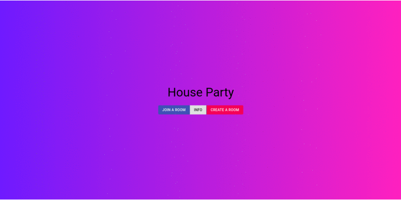

# Music-Controller
# </img>    




## Setup Instructions

### Install Required Python Modules

```bash
pip install -r requirements.txt
```
### Start Web Server

To start the web server you need to run the following sequence of commands.

First cd into your desired tutorial folder (replace x with tutorial number).
```bash 
cd "Tutorial x"
```
Next run the django web server.
```bash
python manage.py runserver
```

### [Install Node.js](https://nodejs.org/en/)

### Install Node Modules

First cd into the ```frontend``` folder.
```bash
cd frontend
```
Next install all dependicies.
```bash
npm i
```

### Compile the Front-End

Run the production compile script
```bash
npm run build
```
or for development:
```bash
npm run dev
```